# Граф концептов базы знаний

_Обновлено: 2026-06-05_

Концептов: **40** | Связей: **607** (мин. вес: 2)

## Диаграмма

```mermaid
graph TD
    уровень["уровень\n(141)"]
    готовности["готовности\n(137)"]
    каталога["каталога\n(80)"]
    caremate["caremate\n(72)"]
    тема["тема\n(68)"]
    кластер["кластер\n(66)"]
    business["business\n(44)"]
    через["через\n(42)"]
    agents{{"agents\n(40)"}}
    social["social\n(39)"]
    skymediahub["skymediahub\n(39)"]
    категория["категория\n(39)"]
    funding["funding\n(37)"]
    inventions["inventions\n(36)"]
    применение["применение\n(36)"]
    robotics["robotics\n(32)"]
    newsroom["newsroom\n(31)"]
    концепция["концепция\n(31)"]
    темы["темы\n(30)"]
    модель["модель\n(29)"]
    patents["patents\n(29)"]
    связь["связь\n(28)"]
    saas["saas\n(28)"]
    срок["срок\n(28)"]
    карточка["карточка\n(28)"]
    бизнес["бизнес\n(27)"]
    forth["forth\n(27)"]
    статус["статус\n(27)"]
    автора["автора\n(27)"]
    новизна["новизна\n(25)"]
    применимость["применимость\n(25)"]
    приоритет["приоритет\n(25)"]
    суть["суть\n(25)"]
    модели["модели\n(24)"]
    бюджет["бюджет\n(23)"]
    sozialplaner["sozialplaner\n(23)"]
    tetradrone["tetradrone\n(22)"]
    источник["источник\n(21)"]
    патентная["патентная\n(21)"]
    budget["budget\n(20)"]
    готовности -- 136 |толстый|--> уровень
    каталога -- 60 |толстый|--> уровень
    готовности -- 59 |толстый|--> каталога
    каталога -- 55 |толстый|--> тема
    готовности -- 49 |толстый|--> тема
    тема -- 48 |толстый|--> уровень
    кластер -- 47 |толстый|--> уровень
    готовности -- 47 |толстый|--> кластер
    business -- 37 |толстый|--> funding
    caremate -- 37 |толстый|--> уровень
    caremate -- 35 |толстый|--> готовности
    inventions -- 29 |толстый|--> patents
    уровень -- 29 |толстый|--> через
    caremate -- 28 |толстый|--> robotics
    готовности -- 28 |толстый|--> через
    social -- 26 |толстый|--> уровень
    категория -- 25 |толстый|--> новизна
    категория -- 25 |толстый|--> применимость
    категория -- 25 |толстый|--> статус
    новизна -- 25 |толстый|--> применимость
    новизна -- 25 |толстый|--> статус
    применимость -- 25 |толстый|--> статус
    готовности -- 25 |толстый|--> применение
    применение -- 25 |толстый|--> уровень
    social -- 24 |толстый|--> готовности
    caremate -- 24 |толстый|--> каталога
    готовности -- 24 |толстый|--> приоритет
    приоритет -- 24 |толстый|--> уровень
    концепция -- 24 |толстый|--> уровень
    каталога -- 24 |толстый|--> темы
    карточка -- 24 |толстый|--> категория
    карточка -- 24 |толстый|--> новизна
    карточка -- 24 |толстый|--> применимость
    карточка -- 24 |толстый|--> статус
    social -- 23 |толстый|--> кластер
    каталога -- 23 |толстый|--> кластер
    кластер -- 23 |толстый|--> тема
    карточка -- 23 |толстый|--> суть
    категория -- 23 |толстый|--> суть
    новизна -- 23 |толстый|--> суть
    применимость -- 23 |толстый|--> суть
    статус -- 23 |толстый|--> суть
    каталога -- 22 |толстый|--> приоритет
    готовности -- 22 |толстый|--> концепция
    автора -- 21 |толстый|--> уровень
    caremate -- 20 |толстый|--> тема
    business -- 20 |толстый|--> уровень
    newsroom -- 20 |толстый|--> уровень
    каталога -- 20 |толстый|--> через
    автора -- 20 |толстый|--> готовности
    agents -- 20 |толстый|--> каталога
    категория -- 20 |толстый|--> патентная
    agents -- 19 |толстый|--> уровень
    бюджет -- 19 |толстый|--> срок
    business -- 19 |толстый|--> готовности
    newsroom -- 19 |толстый|--> готовности
    каталога -- 19 |толстый|--> модель
    каталога -- 19 |толстый|--> применение
    карточка -- 19 |толстый|--> патентная
    business -- 18 |толстый|--> caremate
```

## Топ концептов по связям

| Концепт | Файлов | Связей | Категория |
|---------|--------|--------|-----------|
| `уровень` | 141 | 749 | other |
| `готовности` | 137 | 729 | other |
| `каталога` | 80 | 583 | other |
| `тема` | 68 | 493 | other |
| `caremate` | 72 | 482 | other |
| `кластер` | 66 | 385 | other |
| `business` | 44 | 332 | other |
| `категория` | 39 | 320 | other |
| `agents` | 40 | 277 | agent |
| `funding` | 37 | 274 | other |
| `skymediahub` | 39 | 273 | other |
| `через` | 42 | 271 | other |
| `применение` | 36 | 265 | other |
| `robotics` | 32 | 262 | other |
| `inventions` | 36 | 260 | other |
| `статус` | 27 | 241 | other |
| `карточка` | 28 | 234 | other |
| `модель` | 29 | 226 | other |
| `новизна` | 25 | 225 | other |
| `применимость` | 25 | 225 | other |
| `концепция` | 31 | 222 | other |
| `patents` | 29 | 218 | other |
| `суть` | 25 | 216 | other |
| `social` | 39 | 215 | other |
| `бизнес` | 27 | 205 | other |
| `newsroom` | 31 | 198 | other |
| `forth` | 27 | 191 | other |
| `срок` | 28 | 187 | other |
| `патентная` | 21 | 186 | other |
| `связь` | 28 | 185 | other |
